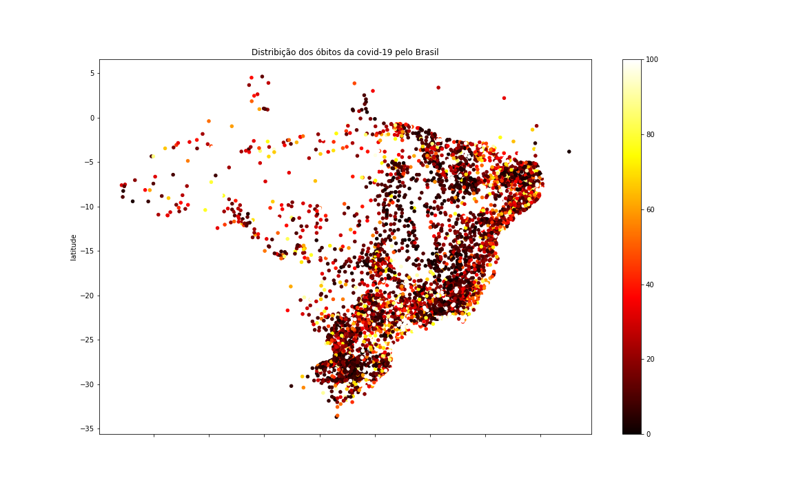

  

  

# Luiz Carlos Vieira 

 ***Biólogo*** Aspirante a uma carreira de analista de dados biológico / Bioinformáta 

Possui graduação em Ciências Biológicas e Mestrado em Ciências pelo Departamento de Biologia Celular e Molecular e Bioagentes Patogênicos.
Atuou como Técnico de Laboratório (Trainne) e Pesquisador (Mestrando) no Centro de Pesquisas em Virologia (USP), onde desenvolveu atividades
de pesquisa e desenvolvimento em virologia.
Mais recentemente, atuou como Analista de Laboratório no controle de qualidade biológica, realizando testes de controle de qualidade de vacinas virais.

** Experiência em: ** Biologia Celular e Molecular, virologia, Python, Análise exploratória de dados, Pandas, Matplotlib.
**Links:**
* [LinkedIn](https://www.linkedin.com/in/luiz-carlos-vieira-4582797b/)

# Sobre este Projeto:

## Análise exploratória dos casos de covid-19 no Brasil (Python).
### Dataset covid19 no Brasil 

Dataset disponibilizados pelo Ministério da Saúde, [Link](https://covid.saude.gov.br/)\
Data de download: 15/07/2021
Também disponibilizei no repositório, um dataset com as coordenadas de latitude e longitude dos municípios,
para fazermos a análise da distribuição geográfica da COVID-19 no Brasil.

### Introdução
COVID-19 é a doença causada por um novo coronavírus denominado SARS-CoV-2. A OMS tomou conhecimento deste novo vírus em 31 de dezembro de 2019, após um relatório de um grupo de casos de "pneumonia viral" em Wuhan, na República Popular da China.

### Objetivos
Com objetivo de aprendizagem à análise exploratória de dados, utilizaremos os dados da doença causada pelo coronavírus 2019 (COVID-19) no Brasil, para responder questões como: 

* 1 - Quantidade de mortes por covid-19 no Brasil?\
* 2 - Quantidade de casos de covid-19 no Brasil?\
* 3 - Quantidade de mortes por covid-19 nos estados brasileiros?\
* 4 - Quantidade de casos de covid-19 nos estados brasileiros?\
* 5 - Quantidade de mortes por covid-19 em algumas capitais brasileiras?\
* 6 - Quantidade de casos de covid-19 em algumas capitais brasileiras?\
* 7 - Distribuição geográfica do covid-19 no território brasileiro?

### Metodologias
Nesta análise usarei algumas ferramentas e métodos de análise de dados, tais como:
* Linguagem Python 
* Pandas (Manipulação dos dados)
* Seaborn e Matplotlib (Visualização dos dados)
* Métodos como merge, concat, drop, resample, formatação dos eixos dos gráficos, query, além de outros filtros, etc... 

### Referências
https://www.who.int/ \
https://covid.saude.gov.br/
